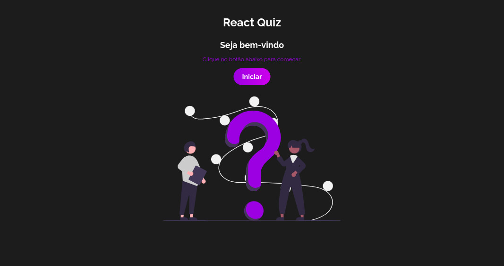

<h1 align="center">React Quiz</h1>

Um jogo de cinco perguntas sobre a linguagem de programação JavaScript em que, dentre as quatro opções de resposta, apenas uma é a correta para se pontuar. Se desafie e descubra se está por dentro dessa tecnologia.

## 🛑| Aviso
Este repositório segue em grande parte o código passado durante as aulas, por causa desse fato certas melhorias podem acabar não sendo aplicadas.

## 🔎| Visualize
Visualize o resultado atual do projeto:

- [Vercel](https://react-quiz-roan.vercel.app/)

## 🛸| Tecnologias
Na construção do projeto foram utilizadas as seguintes tecnologias:

- [HTML](https://developer.mozilla.org/pt-BR/docs/Web/HTML)
- [CSS](https://developer.mozilla.org/pt-BR/docs/Web/CSS)
- [JavaScript](https://developer.mozilla.org/pt-BR/docs/Web/JavaScript)
- [ViteJS](https://vitejs.dev/)

## 🎯| Bibliotecas
Na construção do projeto foram utilizadas as seguintes bibliotecas:

- [ReactJS](https://pt-br.reactjs.org/)
- [Google Fonts](https://fonts.google.com/)

## 👥| Autor(es)
Autores e contribuidores do projeto:

- [Wesley Nilton](https://github.com/Wesley-Nilton)